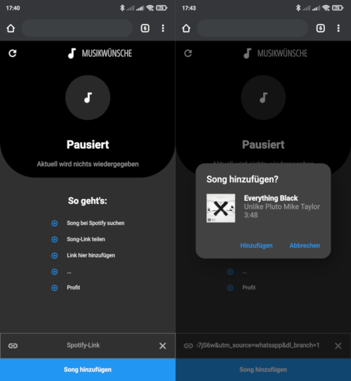
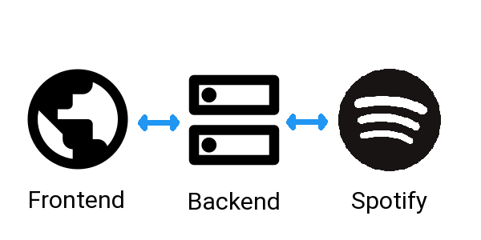

# PartyMusic
PartyMusic is a simple WebApp I programmed for a small party. Party guests can use the app to add song requests directly to the queue without having to operate the playback device. The app needs to be connected to a Spotify account and automatically adds songs to the current playback device via the Spotify api.

## Design

### Frontend
WebApp developed in flutter, optimized and build for mobile browsers.

### Backend
REST-like API developed in java with dropwizard framework. Packed inside a docker image for easy deployment.

## Setup
### Spotify developer account
0. Own a Spotify account
1. Create a Spotify app at https://developer.spotify.com/dashboard/applications
2. Copy ClientID
3. Copy ClientSecret
4. Edit App-Settings
    - Change Redirect URI to [Backend deploy point]/v1/auth/spotify/callback/

### Backend
Requirements for building:
- JDK (Tested with openjdk 11.0.9.1)
- Docker
- Maven

Building:
1. Open config file party-server/stuff/config.yml
2. Paste Spotify ClientID and ClientSecret
3. Fill URL with [Backend deploy point]
4. Create api key
    1. Create shared secret for example sha1 hash of something
    2. Create sha256 hash of secret
    3. Paste sha256 hash to config
5. Setup CORS (optional)
6. Copy config to party-server/build/config.yml
7. Build server image with ``./make.sh``
8. Create server directory  ``mkdir /usr/local/partyserver``
9. Deploy docker image ``partyserver`` to server or run localy ``./run.sh``

Connect playback spotify account:
1. (Browser) Navigate to [Backend deploy point]/auth/spotify
2. Connect account

Disconnect playback spotify account:
1. (Browser) Navigate to [Backend deploy point]/auth/spotify/logout

### Frontend
Requirements for building:
- Flutter (Tested with Flutter 2.2.2)

Building:
1. Open api.json file party_music_frontend/api.json
2. Change url to [Backend deploy point]
3. Change key to api key (secret)
4. Copy api.json to party_music_frontend/assets/api.json
5. Build web frontend with ``flutter build web``

## TODO
- [ ] Translation
- [ ] Code documentation
- [ ] Improve playback account connection
- [ ] Improve deployment
- [ ] Song request throtteling